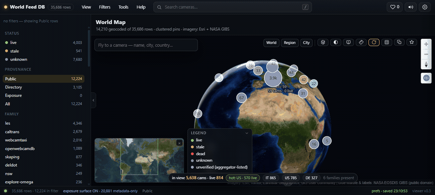
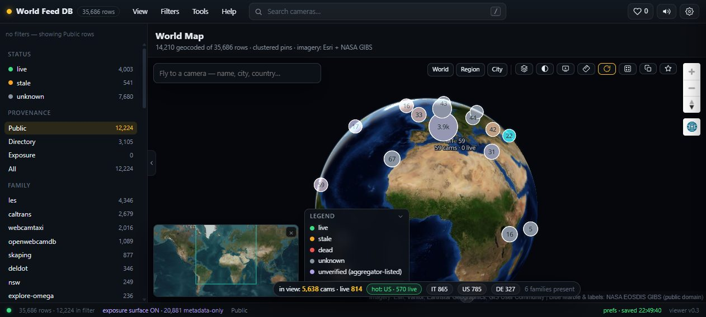
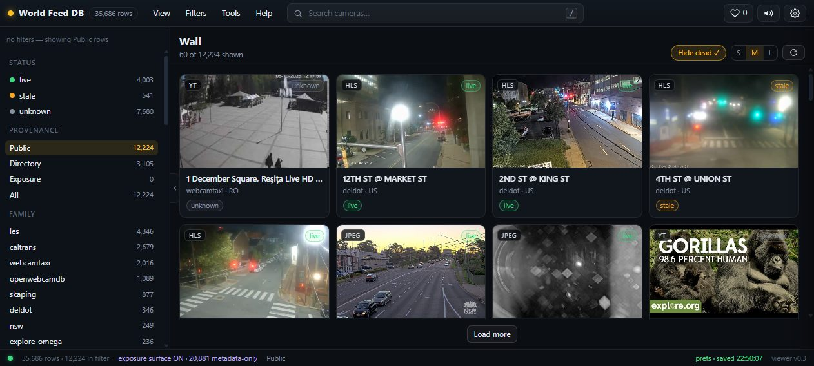
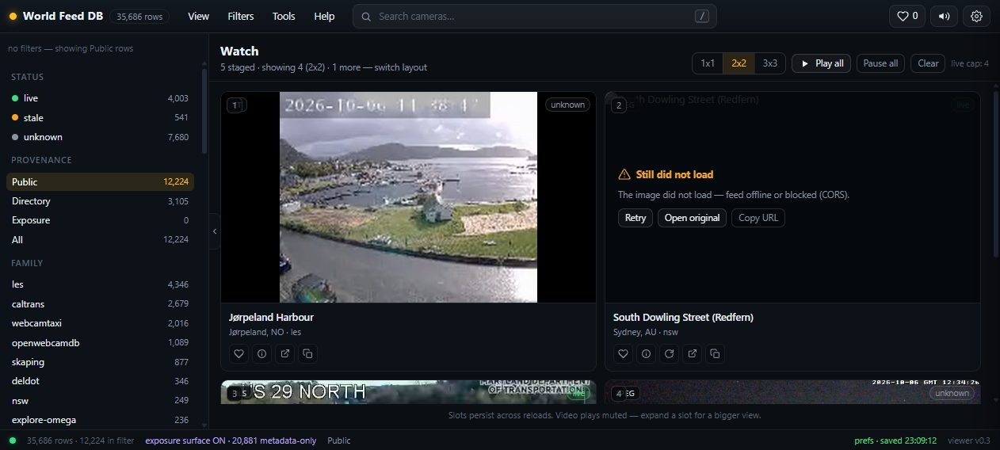

# World Feed DB

A worldwide, self-healing database and viewer for public live video feeds — traffic cams, webcams, HLS/MJPEG/JPEG-refresh streams, and YouTube-live channels.

## What it looks like









## What it is

World Feed DB collects public live video feeds, keeps them in one registry, checks whether they actually work, and shows them on a local web page: a map, a 3D globe, a wall of previews, a multi-watch grid, and a search you can filter by country, protocol, source family and status.

Feed lists rot — links die, streams freeze on a single frame, pages move. So the registry treats liveness as something to be earned. Every row records where the feed came from (its provenance) and a health state that only a real check can set: rows enter as `unknown`, and only the health engine may write `live`, `stale` or `dead`. Failures accumulate; a row that fails ten consecutive checks is quarantined automatically, and any later good result restores it. Nothing is ever marked live because it looked plausible.

The sources are public by design: government traffic agencies, institutional and vendor webcams, public directories. Where a source gates its API behind a key, you supply your own — the app runs fine without keys and says so honestly (`UNAVAILABLE · KEY REQUIRED`) instead of failing silently. The registry database and every ingest output live under `data/` and are never committed: code travels, data stays.

There is also a flagged exposure-camera layer (datasets of documented exposed cameras). It is off in the public build, it is dataset-aggregation only, and it never contacts devices — see below.

## Status

Research first, build second. The source survey is done — five survey waves plus a collected browser-tab corpus, collated in `SOURCES-CATALOG.md`. The build side has a working pipeline: ingesters for the bundled L-E-S corpus, four government agency lanes and twelve new-source families, a registry database, health sweeps with self-heal accounting, city geocoding, a resolver for embed-only sources, and the viewer. The author's registry held 35,686 rows at last count, 14,805 of them public/directory feeds. It is beta software: expect rough edges and moving numbers.

## Quick start

Needs **Python 3.11+**. Nothing to install for the quickstart.

```bash
git clone https://github.com/ModdySwag/world-feed-db
cd world-feed-db

py -3.11 -m wfd status
```

`status` prints your active profile, the exposure-surface state, an OK/MISSING line per known key, and the db summary. On a fresh clone: profile `clean`, exposure `off`, every key `MISSING`, db not created yet. (On systems without the Windows `py` launcher, the same commands run as `python -m wfd …`.)

Put some rows in. The fastest demo needs no network and no key — it parses the bundled L-E-S corpus (a committed snapshot of public streams):

```bash
py -3.11 -m wfd.ingest.les      # -> data/ingest/les.jsonl (~6,000 rows)
py -3.11 -m wfd db load         # -> data/worldfeed.db (idempotent; safe to re-run)
py -3.11 -m wfd viewer          # -> http://127.0.0.1:8773/
```

The viewer opens on the Overview; the menu bar and number keys reach the other seven views. Map plots clustered status-coloured pins, World Map is a 3D globe with fly-to search, Wall is a poster-first grid, Watch plays feeds side by side (1×1 up to 3×3), Search is full-text with facets, Personal stores favourites, Help documents the rest. Everything loaded this way is `unknown` — nothing has been checked yet. To get real verdicts:

```bash
py -3.11 -m wfd health run --family les --limit 50
```

Sweeps are resumable — stop and re-run any time; rows checked today are skipped unless you pass `--recheck`. Only rows with a probeable protocol (hls/mjpeg/jpeg/youtube) are swept; page-URL rows stay `unknown`.

Want a network demo instead? The new-source families are keyless:

```bash
py -3.11 -m wfd.ingest.newsrc list                     # twelve families
py -3.11 -m wfd.ingest.newsrc explore-omega --limit 5  # explore.org's public cam list
```

Fetches are cached under `data/ingest/cache/`, so a killed run resumes where it stopped (`--refresh` refetches).

Optional, once you have rows — offline city enrichment for geocoded feeds:

```bash
py -3.11 -m wfd geo fetch       # one-time GeoNames cities1000 download (CC BY 4.0)
py -3.11 -m wfd geo city        # fills city names; resumable
```

## Requirements

- Python 3.11+. The core is standard-library only — the quickstart installs nothing. (Developed and tested on Windows with 3.11.)
- Optional extras; each unlocks a lane, and each degrades honestly when missing rather than guessing:
  - `ffmpeg` + `ffprobe` on PATH — stream health probes (structure, decode, freeze/black detection). Without them, stream probes report `unknown` with a "not found" note.
  - `yt-dlp` (plus a JS runtime such as `deno`) — YouTube live checks and channel resolution. Without them, YouTube rows stay `unknown`.
  - `keyring` — OS keychain backend for the credential store. Without it the store falls back to a DPAPI-encrypted file (Windows) or a loudly-warned plaintext file (last resort).
  - `Pillow` + `ImageHash` — still-image freshness checks (two-sample perceptual hash). Without them, still-image probes report `unknown`.

## Keys and profiles

The repo ships the **clean** profile: keyless, honest, nothing to configure. Key-gated lanes show `UNAVAILABLE · KEY REQUIRED · <service>` until you supply your own credentials. Three mechanics:

- **Checklist:** `py -3.11 -m wfd keys` prints every service with `OK (source)` or `MISSING — UNAVAILABLE · KEY REQUIRED · <service>`. `wfd status` shows the same for the five known keys.
- **Credential store:** `py -3.11 -m wfd creds set WINDY_API_KEY` reads the value hidden and stores it in the OS keychain (or the fallback backends). Values are never printed, logged or committed.
- **Overlay profile:** create `profiles/<name>/` with an optional `settings.json` and `.env`; select it via `profiles/ACTIVE` or the `WFD_PROFILE` environment variable. Keep it out of git. Example `.env` (a placeholder-only file ships at `profiles/clean/.env.example`):

```text
# profiles/<your-profile>/.env — never commit
WINDY_API_KEY=YOUR_KEY_HERE
ROAD511_API_KEY=YOUR_KEY_HERE
NSW_API_KEY=YOUR_KEY_HERE
QLDTRAFFIC_API_KEY=YOUR_KEY_HERE
```

Key-gated lanes today: Windy Webcams API, Road511 (`X-API-Key` header), Transport for NSW (`apikey` header), QLDTraffic (key in the URL query, per its spec), and Shodan for search-only discovery. Signup links are in `ACCOUNTS-AND-KEYS.md`.

## Health and honest states

States are `live`, `stale`, `dead`, `unknown` — plus `unverified` for flagged exposure rows and `quarantined` for rows that failed ten consecutive probes. Enumeration can never claim liveness; only a probe can.

What a check does, by feed type:

- Streams (HLS/MJPEG): `ffprobe` must show a video track, `ffmpeg` must decode one second cleanly, then a motion pass flags frozen or black feeds as `stale`.
- Still images: two samples a gap apart; a perceptual-hash distance under the threshold reads `stale`. Gaps are calibrated per source — refresh cadence varies a lot.
- YouTube: a `yt-dlp` live gate.

Every verdict updates the row's consecutive-failure streak: ten consecutive `dead` verdicts quarantine it, any later `live`/`stale` result restores it. Sweeps write an evidence JSONL per run under `data/health/` and are polite by construction — per-host concurrency caps and spacing, and no slice ever touches exposure rows (enforced in SQL, not by convention).

## Exposure category

The project keeps a separately flagged category for exposed-camera datasets (insecam-class listings). It exists because this project is also a research record; the rules the code enforces are:

- **Datasets only.** Rows come from static third-party dataset files. The ingester never fetches device URLs or view pages.
- **Flagged and honest.** Rows are `status=unverified` with a snapshot date, low geo-confidence, and credentials scrubbed at parse time.
- **Metadata only in the UI.** No URL, no preview, no autoplay — a click-through warning instead.
- **Never probed, never relayed.** The health engine excludes them (SQL-enforced); the resolver never serves them.

In the `clean` profile `private_exposure_surface` defaults to `false`, the viewer excludes exposure rows from every endpoint, and the raw datasets are not shipped (they are gitignored, unlicensed, and only ever consumed as local reference files). The switch, the rules and the reasoning are documented in `docs/ARCHITECTURE.md` and `PLAN.md`. In this public build it stays off.

## Repo layout

| Path | What |
|---|---|
| `wfd/` | the Python package — schema, profiles, credential store, DB, health engine, viewer, resolver, geocoder |
| `wfd/ingest/` | ingesters: `les` (bundled corpus), `gov/` (agency enumerators), `newsrc/` (new-source families), `exposure` (flagged datasets) |
| `wfd/web/` | the viewer UI plus vendored JS (Leaflet, markercluster, hls.js, MapLibre GL) — no runtime CDN |
| `wfd/web/vendor/` | vendored frontend assets, with licence notes in `README.txt` |
| `docs/` | build contracts (`ARCHITECTURE.md`) and the viewer spec |
| `profiles/clean/` | the keyless default profile that ships with the repo (`.env.example` included) |
| `research/` | source survey evidence, wave dossiers, and the L-E-S corpus the demo ingest reads |
| `scripts/` | release tooling — the secret-scan gate and the fresh-clone test |
| `tests/` | plain-python test runners |
| `data/` | registry DB + ingest outputs — gitignored (code travels, data stays) |
| top level | `PLAN.md` (living build record), `SOURCES-CATALOG.md` (collated sources), `ACCOUNTS-AND-KEYS.md` (key checklist) |

## License and credits

MIT License. Copyright (c) 2026 Moddy.

Vendored frontend libraries, served locally (the viewer has no runtime CDN):

- Leaflet 1.9.4 — BSD-2-Clause
- Leaflet.markercluster 1.5.3 — MIT
- hls.js 1.5.17 — Apache-2.0
- MapLibre GL JS 5.24.0 — BSD-3-Clause

Geocoding data: GeoNames cities1000, CC BY 4.0. Map tiles: © OpenStreetMap contributors. Globe imagery: Esri World Imagery and NASA EOSDIS GIBS (public domain); the optional Sentinel-2 cloudless layer is EOX, CC BY-NC-SA 4.0, off by default.

Feed URLs and metadata belong to their operators. The registry stores references, and playback points your player at the source. The ingesters rate-limit themselves (≥1 s per host by default); respect each source's terms and robots when you add sources.

## Development

Run everything from the repo root as modules: `py -3.11 -m wfd <command>`.

Tests are plain Python runners — no pytest required. Each file runs standalone and prints `PASS`/`FAIL` lines, exiting non-zero on failure:

```bash
py -3.11 tests/test_core.py
```

Every `tests/test_*.py` follows the same pattern, so run them one by one or in a shell loop. Two of them (`test_viewer`, `test_resolve`) exercise the API against a built registry and skip loudly when `data/worldfeed.db` is absent — run the quick start first if you want them full.

Release tooling lives in `scripts/`:

```bash
py -3.11 scripts/secret_scan.py [--history]   # secret gate before any push
py -3.11 scripts/cold_clone_test.py           # fresh-clone proof (clone -> status -> suites -> viewer boot)
```

`docs/ARCHITECTURE.md` holds the module contracts; new ingest families follow the pattern in `wfd/ingest/newsrc/`.

